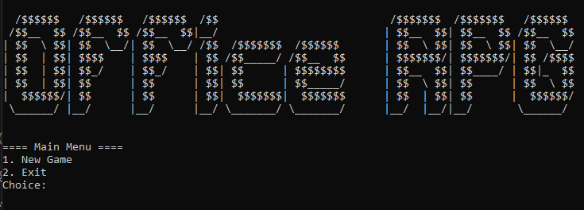
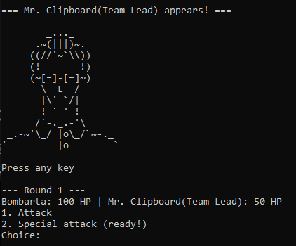
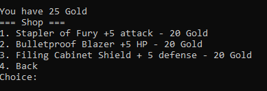

# Simple Python RPG

A tiny, office-themed RPG written in Python. This project started as a way to practice using imports, modules, and classes. Choose between two character classes, fight evil Interns and five Bosses, and upgrade your gear in the office shop

## Credits

- ASCII faces generated with [ASCII Face Maker](https://adelfaure.itch.io/ascii-facemaker)  
- Banners generated with [TAAG Text Generator](https://patorjk.com/software/taag/)

## Screenshots

